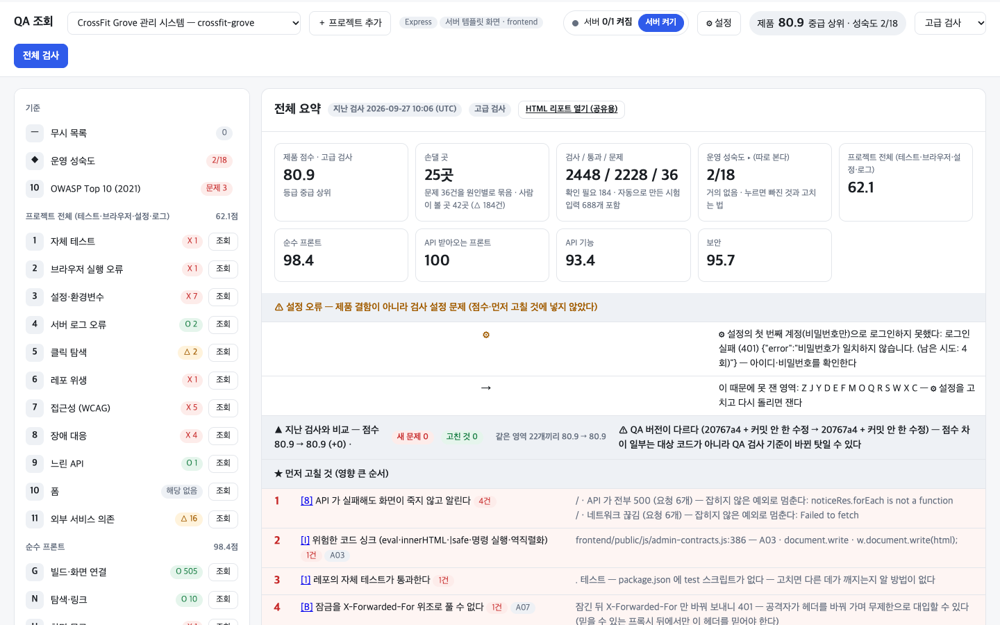

# 웹앱 건강검진 (webapp-checkup)

**딸깍 한 번, 레포를 넣으면 실제로 돌려서 잡는 웹 QA — 실행할 때 AI 토큰 0**



<sub>CrossFit Grove(Express + 서버 템플릿) 레포를 더블클릭 한 번에 — 검사 2,448건 · 손댈 곳 25곳 · OWASP Top 10</sub>

폴더 하나를 주면 스택을 알아서 찾고, 서버를 켜고, 로그인하고, 버튼을 누르고, 검사 케이스 수천 건을 스스로 만들어 두드린다.
판정은 전부 규칙 기반 코드라 **AI 토큰을 쓰지 않고, 같은 코드에 돌리면 결과가 매번 같다.**

- 🔁 **실제로 돌려 본다** — 서버를 설치·빌드·실행하고, 로그인해서 업무 흐름(만들기 → 목록 → 고치기 → 지우기)을 끝까지 따라간다
- 🧮 **검사를 스스로 만든다** — 코드의 입력 규칙(zod · Bean Validation · pydantic · Django 폼)을 읽어 경계값·타입·주입 문자열 조합으로 한 번에 **약 3,000건**
- 💸 **실행당 AI 비용 0** — 같은 범위를 LLM 으로 판정하면 1회 약 $5~35 ([계산 근거](docs/AI_토큰비용_근거.md))
- 🛡️ **OWASP Top 10 (2021)** — 모든 보안 검사에 A01~A10 을 붙여 항목별로 통과·문제·확인 필요·못 잼
- 🇰🇷 **한국어 리포트** — 무엇이 문제고, 왜 위험하고, 어떻게 고치나 + **먼저 고칠 것 Top 10**
- 📈 **초급 → 전문가** — 검사 수준 4단계. 고급은 권한 상승·동시 수정 유실·CSRF·오픈 리다이렉트·Web Vitals, 전문가는 세션 고정·API 요청 제한·업로드 제한·HSTS 까지. 운영 성숙도는 제품 점수와 따로 본다
- 🖱️ **딸깍** — 실행 파일 더블클릭 → 브라우저 화면. 명령줄·CI(GitHub Actions)도 된다

기본기를 한 번에 본다 — 접근성(axe-core)·의존성 취약점(npm audit)은 안에서 그대로 쓰고,
깃 기록 속 비밀(gitleaks 류)·보안 헤더·주입(ZAP 일부)·화면 무게·메타(Lighthouse 일부)를 같은 리포트에 모은다.

## 무엇을 넣고, 무엇을 찾나

| 넣는 것 (자동 감지 · 한 레포에 섞여도 된다) | 찾는 것 (37개 영역) |
|---|---|
| **서버** Next.js · Nuxt · Express · NestJS · Django · Spring Boot · FastAPI · Vapor(Swift) | **프로젝트 전체 11** 자체 테스트 · 브라우저 실행 오류 · 설정·환경변수 · 서버 로그 · 클릭 탐색 · 레포 위생 · 접근성 · 장애 대응 · 느린 API · 폼 · 외부 서비스 의존 |
| **화면·앱** React · Vue · Expo(웹 모드면 브라우저 검사까지) · iOS(Swift, 코드 검사) · 정적 HTML · 서버 템플릿(EJS·Django) | **A~Z 26** API 계약 · 인증 · 권한(IDOR) · 입력 검증 · 주입·SSRF · 비밀·암호화 · 개인정보 · 동시성 · 금액 · 시간·날짜 · 업무 흐름 … |
| **로컬 DB** `.env` 가 가리키는 Postgres·MySQL·Redis 를 Docker 로 켠다 | **운영 성숙도 10** CI · 자동 테스트 · 장애 감시 · 시험 환경 · 백업 · 되돌리기 … |

## 다른 도구와 무엇이 다른가

| | 이 QA | URL 스캐너 | 코드만 읽는 린터 | LLM 에이전트 |
|---|---|---|---|---|
| 실제 서버·화면을 돌려 봄 | O | 일부 | X | 일부 |
| 업무 흐름·동시 요청·장애 흉내 | O | X | X | 일부 |
| 실행당 AI 비용 | 0 | 0 | 0 | 있음 |
| 같은 코드 → 같은 결과 | O | O | O | X |

**실제로 잡은 것** — 첫 화면이 API 장애 때 멈추는 버그(`noticeRes.forEach is not a function`),
UTC 날짜가 한국 시간 0~9시에 하루 밀리는 표시, `X-Forwarded-For` 헤더 하나로 풀리는 로그인 잠금,
같은 신청을 동시에 5번 보내면 5개가 생기는 중복 데이터, Django 모델을 바꾸고 빠뜨린 마이그레이션.

## 시작하기

| 방법 | 이럴 때 | 실행 |
|---|---|---|
| **화면** | 처음 쓸 때 · 결과를 눌러 보며 볼 때 | `QA 실행 (Mac).command` / `QA 실행 (Windows).bat` 더블클릭 |
| **명령줄** | 한 번 돌리고 결과만 볼 때 | `node run.js <레포 폴더>` |
| **CI** | 푸시·PR 마다 새 문제를 막을 때 | [`docs/ci/qa-github-actions.yml`](docs/ci/qa-github-actions.yml) 을 대상 레포 `.github/workflows/` 로 복사 |

```bash
node run.js ~/Developer/my-app                 # 전체 검사 (꺼진 서버는 QA 가 켠다)
node run.js my-app --level=초급                 # 검사 수준 — 초급·중급·고급(기본)·전문가
node run.js my-app --only=B,F,I                 # 영역 골라서
node run.js my-app --ci --fail-under=60         # CI — 새 문제가 생기거나 점수가 기준 아래면 실패
node run.js . --staged                          # 커밋 직전 — git add 한 것에 키·.env 가 섞였으면 멈춘다
```

1. **＋ 프로젝트 추가** → 레포 폴더 경로
2. **⚙ 설정** → 로그인이 있으면 검사용 계정 (가입 경로가 있으면 비워 둬도 자동으로 만든다)
3. **전체 검사** → 요약 · 영역별 O/X 목록 · OWASP 탭 · HTML 리포트(팀에 그대로 보낼 수 있는 파일 하나)

필요한 것: Node.js (LTS) · 크롬이나 엣지 (브라우저를 따로 내려받지 않는다). 실행 파일이 첫 실행 때 `playwright-core`·`axe-core` 를 설치한다 (명령줄은 `npm install` 한 번).

## 알려진 한계

- **검사는 대상 서버에 데이터를 만든다.** 운영 서버·실제 DB 에 돌리지 않는다. 만든 것은 끝나면 지우지만, 지우는 경로가 없거나
  응답에 id 가 없는 자원은 남는다 (리포트에 "남긴 것: 경로별 N개" 로 알린다). 처리 코드가 문자·메일·결제를 부르는 경로는 건드리지 않는다.
- **서버가 뜨지 않으면 그 영역은 점수에서 뺀다.** 점수와 함께 "몇 개 영역을 쟀나" 를 꼭 본다.
- 규칙은 코드에 적힌 만큼만 읽는다 — 손으로 짠 `if` 검증은 '서버 오류가 안 나는가' 만 보고 △ 로 남긴다.
- `확인 필요(△)` 는 결론이 아니라 사람이 볼 목록이다. 부하 시험이 아니다.

## 문서

- [상세 설명서](docs/QA_상세설명서.md) — 검사 수준 · 지원 스택 · 검사를 만드는 방식 · OWASP 대응 · 37개 영역 표 · 점수 공식 · 프로젝트 전용 설정 · 구조
- [AI 토큰 비용 근거](docs/AI_토큰비용_근거.md)
- [전체 점검 (2026-09-27)](docs/2026-09-27_QA_전체점검.md) — 알려진 문제와 고치는 순서
- QA 자체 테스트: `npm test` — 버그를 심은 시험용 레포를 끝까지 돌려 모두 잡는지 본다
