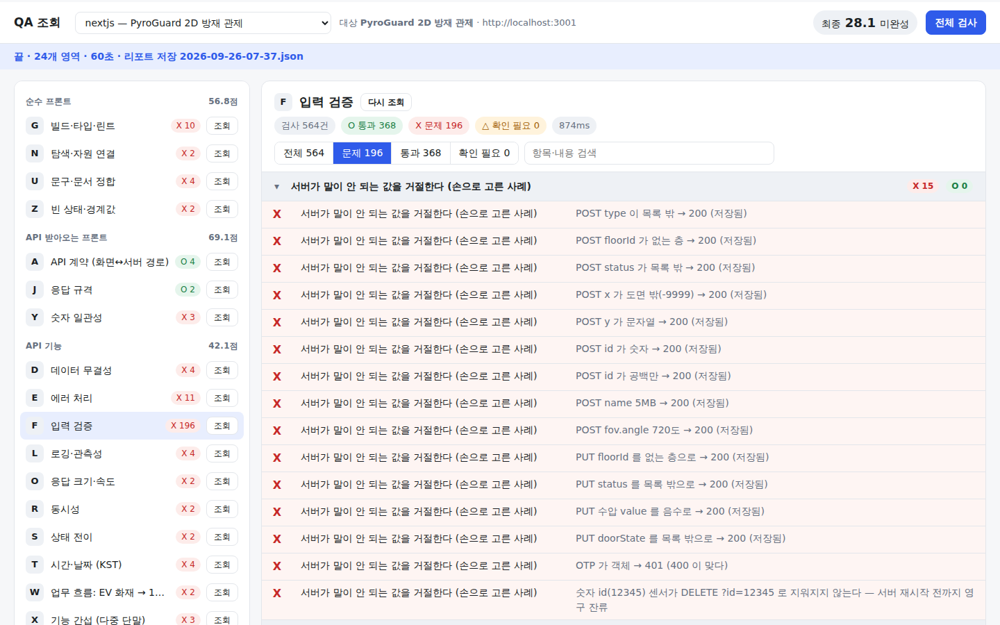

# QA — 스택별 웹 서비스 품질 측정 도구

스택 조합마다 도구가 하나씩 있다. 도구끼리는 서로 모르고, 점수 공식(`common/`)만 같이 쓴다.
점수 공식과 등급의 뜻은 [`express-ejs/README.md`](express-ejs/README.md) 에 있다.

| 도구 | 스택 | 대상 레포 | 상태 |
|---|---|---|---|
| `express-ejs` | Express + EJS + Postgres | crossfit-web (CrossFit Grove) | 26개 영역 완성 |
| `react-express` | React(Vite) + Express + SQLite | Team-Lambda | 틀만 |
| `react-spring` | React(Vite) + Spring Boot (+ FastAPI) | Team_Namoo | 틀만 |
| `django-template` | Django 템플릿 | django-community-crud | 틀만 |
| `expo-express` | Expo + Express + Prisma | healthcheck-app-frontend / backend | 틀만 |
| `nextjs` | Next.js App Router | pyroguard2d | 24개 영역 완성 (M·Q 해당 없음) |
| `static-js` | 순수 JS 정적 페이지 | universeproject | 틀만 |

```
node express-ejs/run.js
node react-spring/run.js --only=a,k
node ui.js                          화면으로 보기 → http://localhost:4545
```

## 더블클릭으로 쓰기

1. QA 폴더의 **`QA 실행.command`** (Windows 는 `QA 실행.bat`) 를 더블클릭 → 브라우저에 조회 화면이 열린다
2. 처음이면 **⚙ 설정** 창이 뜬다 — 대상 레포 폴더, 로그인 비밀번호, OTP 를 넣고 저장
3. 위쪽 **[서버 켜기]** — 대상 레포에서 설치 → 빌드 → 실행을 알아서 한다 (처음 1~2분). 대상에 `.env.local` 이 없으면 설정값으로 만들어 준다
4. **[전체 검사]** 또는 영역마다 **[조회]** → 결과가 O / X 목록으로

- **⚙ 설정 → [⬇ 최신 코드 받기]** 는 QA 와 대상 레포를 `git pull` 한다. QA 코드가 바뀌면 화면이 새 코드로 다시 뜬다.
- 터미널 창을 닫으면 화면과, 화면이 켠 대상 서버가 함께 꺼진다.
- 설정은 이 컴퓨터의 `.qa-local.json` 에만 저장된다 (깃에 올라가지 않는다). 대상 레포에 `.env.local` 이 이미 있으면 거기서 읽는다.
- Node.js 가 없으면 설치 페이지를 연다. Mac 에서 "확인되지 않은 개발자" 경고가 뜨면 파일을 **우클릭 → 열기** 로 한 번 연다.

## 화면으로 보기 — `node ui.js`

영역마다 **[조회]** 버튼이 있고, 누르면 그 영역을 검사해서 본 것 하나하나를 **O(통과) / X(문제) / △(확인 필요)** 로 보여 준다.
`문제만` 필터와 검색이 있고, **[전체 검사]** 를 누르면 점수 요약(칸별 점수·운영 성숙도·자기 점검)과 리포트 파일이 남는다.

- 도구가 쓰는 환경변수(`QA_ROOT`, `QA_BASE`, `QA_OPERATOR_PW` …)를 `ui.js` 를 띄울 때 함께 준다.
- 이 컴퓨터에서만 열린다(127.0.0.1). 검사가 대상 서버에 데이터를 만들고 지우므로 한 번에 하나만 돈다.
- 처음 열면 **같은 대상 주소를 잰** 가장 최근 리포트를 보여 준다.



## 규칙에서 검사를 만든다 — `common/contract.js`

케이스를 사람이 하나씩 쓰면 열댓 개에서 멈춘다. 대신 도구의 `contract.js` 에 **데이터 모양(필드 규칙)** 을 적으면
공용 엔진이 검사를 만든다.

| 만드는 것 | 방법 | 판정 |
|---|---|---|
| 필드별 값 | 필드마다 빠짐·null·경계값·범위 밖·타입 오류·빈값·길이 초과·주입 문자열 … | 맞는 값은 **저장되고 그대로 돌아와야**, 틀린 값은 **4xx 로 거절되고 아무것도 안 바뀌어야** |
| 필드 간 규칙 | `rules` 에 적은 규칙마다 위반 본문을 등록·수정 둘 다로 | 거절 |
| 목록 값 조합 | 페어와이즈 — 모든 두 값 짝을 덮는 최소 조합 (pyroguard 센서: 704가지 → 176가지) | 규칙 위반이 아니면 전부 저장 |
| 본문 모양 | 빈 객체·배열·깨진 JSON·깊은 중첩·모르는 필드 | 거절, 모르는 필드는 저장 안 함 |
| 인증 매트릭스 | 공개 경로를 뺀 모든 경로 × 토큰 없음·엉터리·변조·형식 다름 (+ 진짜 토큰) | 가짜는 401/403, 진짜는 통과 |

어떤 경우든 **5xx 는 불합격**이다. 규칙은 서버 코드가 아니라 **API 명세**에서 옮긴다 — 서버를 베끼면 서버가 틀릴 때 같이 틀린다.
예시: [`nextjs/contract.js`](nextjs/contract.js)

## 도구 하나의 모양

```
<도구>/
  qa.config.js   대상 레포 위치, 주소, 소스 폴더
  stack.js       이 스택에서 달라지는 것 — API 경로 찾는 법, 로그인하는 법
  contract.js    (선택) 데이터 모양 규칙 — common/contract.js 가 검사를 만든다
  front/         순수 프론트          G 화면연결 · N 탐색 · U 문구 · Z 빈 상태
  front-api/     API 받아오는 프론트   A API 계약 · J 응답 규격 · Y 숫자 일관성
  api/           API 기능            D E F L M O Q R S T W X
  security/      보안                B 인증 · C 권한 · H 헤더 · I 주입 · K 비밀 · P 개인정보 · V 의존성
  README.md      이 스택에서 각 영역을 무엇으로 보는지
```

결과는 칸별 점수와 전체 점수로 나온다. `todo: true` 가 붙은 영역 파일은 **아직 안 만든 빈 칸**이라 점수에서 뺀다.
해당 없는 영역은 파일을 지운다(예: 돈을 안 다루면 `api/m_money.js`).

## 새 스택 조합 추가

```
cp -R _template react-django
```

그다음 `qa.config.js` → `stack.js` → `README.md` 표 → 영역 파일 순서로 채운다.
